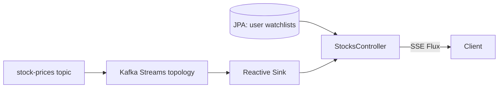

# Tickers

A reactive stock-ticker service built with **Spring WebFlux** and **Kafka Streams**. Users save stocks to a watchlist and receive live price updates in real time over Server-Sent Events (SSE).

## Tech stack

- Java 25, Spring Boot 4
- Spring WebFlux (fully reactive, non-blocking web layer)
- Kafka Streams (real-time price processing)
- Spring Data JPA + H2 (durable per-user watchlists)
- Project Reactor (`Flux` / `Mono`)
- springdoc-openapi (WebFlux UI)

## Architecture

The system separates **durable account data** from the **live price feed**:

- **Watchlists** (which stocks a user saved) live in a relational DB via JPA — easy per-user queries and CRUD.
- **Prices** flow through a Kafka Streams topology. Each tick is parsed and pushed onto a reactive sink, which WebFlux exposes as an SSE stream filtered to the user's saved symbols.



### Key components

| Component | Responsibility |
|-----------|----------------|
| `StockPriceStream` | Kafka Streams topology; consumes `stock-prices`, parses ticks, emits them to a reactive `Sinks.Many` |
| `KafkaStreamsConfig` | Enables Kafka Streams (`@EnableKafkaStreams`) |
| `StockPriceService` | Filters the live price feed down to a set of symbols |
| `StockService` | Loads/saves watchlist entries, offloading blocking JPA to `Schedulers.boundedElastic()` |
| `StocksController` | Reactive REST + SSE endpoints |

## API

| Method | Path | Description |
|--------|------|-------------|
| `GET` | `/api/users/{userId}/stocks` | List a user's saved stocks |
| `POST` | `/api/users/{userId}/stocks` | Save a stock to a user's watchlist |
| `GET` | `/api/users/{userId}/stocks/stream` | SSE stream of live prices for the user's saved symbols |

### Price message format

Messages on the `stock-prices` topic are JSON matching the `StockPrice` record:

```json
{ "symbol": "AAPL", "price": 192.35, "timestamp": "2026-08-14T12:00:00Z" }
```

## Running locally

1. Start a Kafka broker on `localhost:9092` and create the topic:

   ```sh
   kafka-topics --create --topic stock-prices --bootstrap-server localhost:9092
   ```

2. Start the application:

   ```sh
   ./gradlew bootRun
   ```

3. Save a stock, then subscribe to the live stream:

   ```sh
   curl -X POST http://localhost:8080/api/users/user1/stocks \
     -H 'Content-Type: application/json' \
     -d '{"name":"Apple","symbol":"AAPL","price":190.00}'

   curl -N http://localhost:8080/api/users/user1/stocks/stream
   ```

4. Publish a price tick to see it stream through:

   ```sh
   kafka-console-producer --topic stock-prices --bootstrap-server localhost:9092
   > {"symbol":"AAPL","price":192.35,"timestamp":"2026-08-14T12:00:00Z"}
   ```

## Configuration

Key properties (see `src/main/resources/application.properties`):

- `spring.main.web-application-type=reactive`
- `spring.kafka.bootstrap-servers=localhost:9092`
- `spring.kafka.streams.application-id=tickers-streams`
- `spring.datasource.url=jdbc:h2:mem:tickers`
